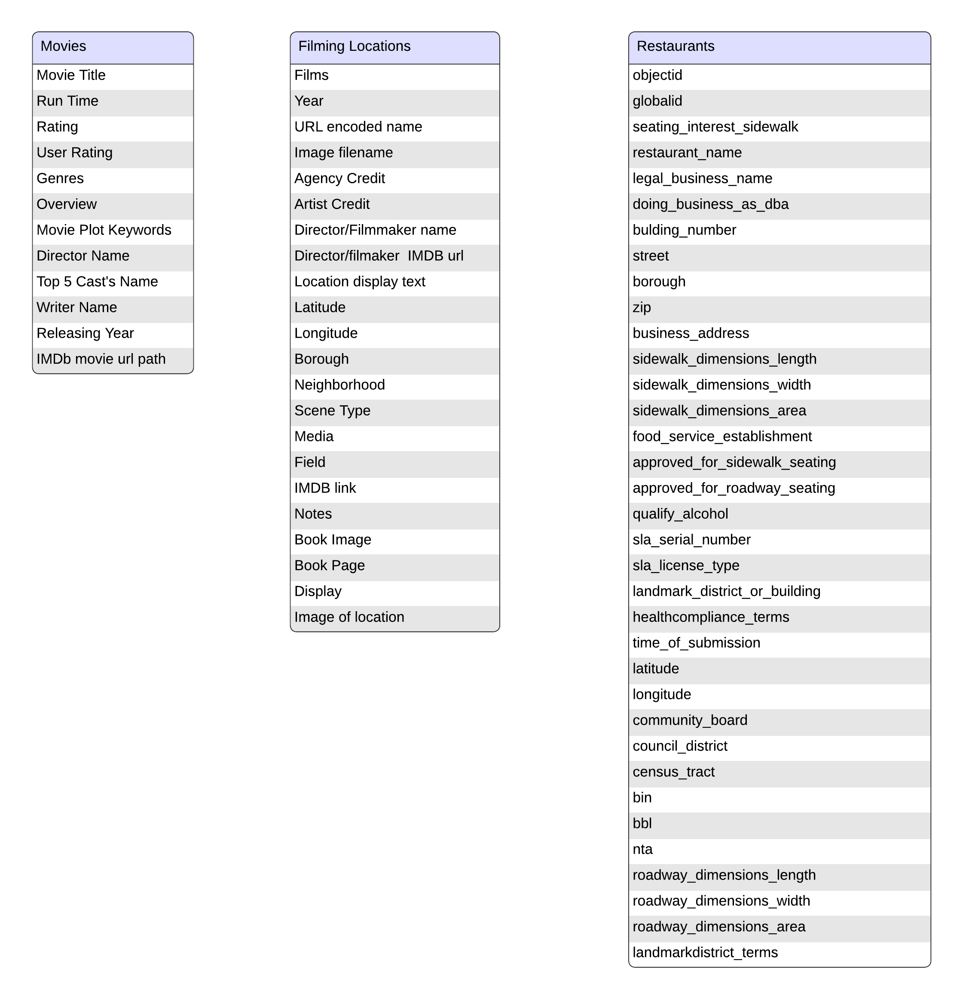
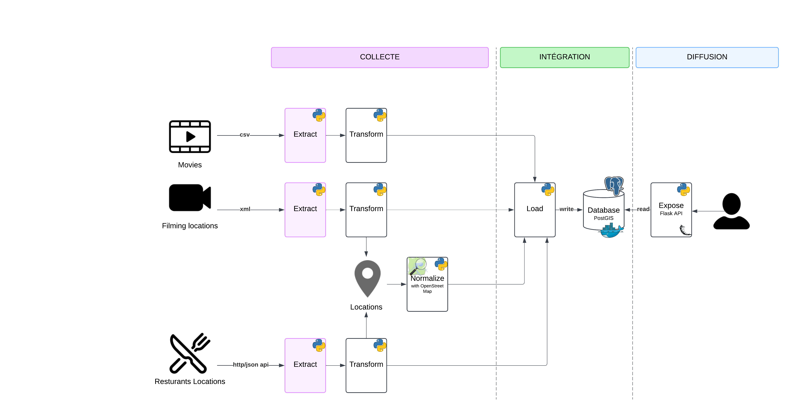
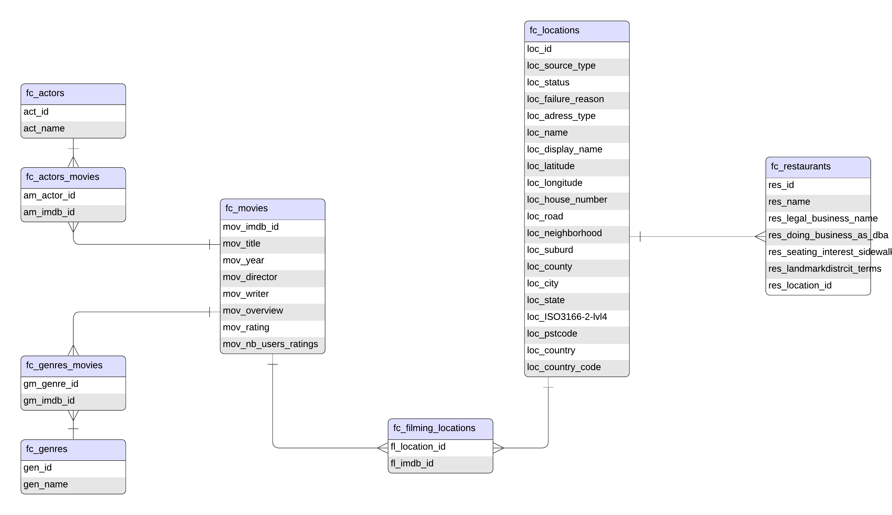
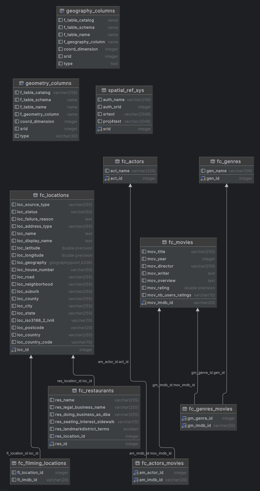

# Food and the City API

## Project Overview
This project is a Flask application designed to query and manage a PostgreSQL/PostGIS database. It allows users to retrieve information about movies, filming locations in New York, and nearby New York restaurants to build customized tourism itineraries based on their favorite movies.

---

## Features
- **Database**: Stores data related to movies, filming locations, and restaurants.
- **Data Ingestion Pipeline**: Extract, transform, and load (ETL) pipeline to populate the database from datasets.
- **API**: REST API to query and manage data.

## Technologies
- **Docker**: Containerization for the database and API services.
- **PostgreSQL extends by PostGIS**: Relational database for storing movie, location, and restaurant data.
- **Flask**: Lightweight Python web framework for the API. [Documentation](https://flask.palletsprojects.com/en/stable/)

## Tools
- **Postman**: API testing and documentation.
- **Jupyter Notebook**: Data exploration and pipeline development.
- **Python 3.10+**: Programming language for the API and scripts. (make sure the path variable is set in the environment variables of your pc)
- **SQLAlchemy**: ORM for database interactions.
- **GeoAlchemy2**: Spatial extension for SQLAlchemy.
- **Pandas**: Data manipulation and analysis.

## External APIs
- **Socrata Open Data API**: For retrieving restaurant data from the New York City Open Data portal.
- **Nominatim API**: For geocoding and reverse geocoding all the adresses [Documentation](https://nominatim.org/release-docs/develop/)

---
## Data Pipeline
The data ingestion pipeline consists of the following steps:
1. **Extract**: Load raw data files from the `datasets` folder.
2. **Transform**: Clean and transform the data to match the database schema.
3. **Load**: Insert the transformed data into the database.

The pipeline is implemented in the `data_ingestion_pipeline.py` script and can be run using the `run_pipeline.sh` script.

### Sources Metadata
| Source                          | Description                                     | Format | Name/Link                                                                                      | Type         | Read Methods   |
|---------------------------------|-------------------------------------------------|--------|-----------------------------------------------------------------------------------------------|--------------|----------------|
| **25k IMDB movies dataset**     | Information about movies, actors, genres, and ratings found in IMDB | CSV    | [utsh0dey/25k-movie-dataset](https://www.kaggle.com/datasets/utsh0dey/25k-movie-dataset)       | Online       | Kagglehub API  |
| **Filming Locations (Scenes from the City)** | Filming locations from the city of New York    | XML    | [Interactive_Map_Data.xml](https://data.cityofnewyork.us/Business/Filming-Locations-Scenes-from-the-City-/qb3k-n8mm/about_data) | Local file   | Pandas csv read |
| **pitm-atqc Socrata API**       | Restaurants in New York                         | JSON   | [Open Restaurant Applications Historic](https://data.cityofnewyork.us/Transportation/Open-Restaurant-Applications-Historic-/pitm-atqc/about_data) | Online       | Socrata API    |




### Data Pipeline Conceptual architecture 


### Database Schema
The database schema consists of the following tables:
- fc_movies : information about movies from imdb datasets
- fc_actors : information about actors extracted from imdb datasets
- fc_actors_movies : relationship between actors and movies
- fc_genres : information about genres extracted from imdb datasets
- fc_genres_movies : relationship between genres and movies
- fc_filming_locations : information about filming locations extracted from the xml film
- fc_restaurants : information about restaurants extracted from the restaurants json api response
- fc_locations : information about locations extracted from the filming locations xml files and the restaurants json api response




---

## Prerequisites
To set up and run this project, ensure you have the following installed:

### Software
- **Docker and Docker Compose**: For database containerization. [Download](https://www.docker.com/products/docker-desktop/)
- **Python 3.10+**: For running the API and scripts. [Download](https://www.python.org/downloads/)
- **Git**: For cloning the repository. [Downloads](https://git-scm.com/downloads)

- **Jupyter Notebook** (optional): For running the data-ingestion-pipeline.ipynb. [View the notebook](https://jupyter.org/try-jupyter/) [Download](https://jupyter.org/install)
- **Postman** (optional): For testing the API endpoints. [Download](https://git-scm.com/downloads) 

### Environment Variables
All environnement variable from the `.env` file must be filled.
The `.env.example` file is provided as a template in the /data-pipeline folder ; you must change it's name to `.env`.
The env variable for the Socrata API would request a quick accout creation and token generation on the Socrata API website.
- **App Token**: App token from the Socrata Open Data API [Create Account](https://dev.socrata.com/foundry/data.cityofnewyork.us/pitm-atqc)

---

## Setup Instructions
Clone the repository and follow these steps to set up the project:
1. Clone the Repository (OR Download .ZIP).
```bash
git clone <repository-url>
cd food-and-the-city
```
2. Run the docker compose in the root folder : 
```bash
docker-compose up --build
```
3. Modify `.env.example` to `.env` and fill in the environment variables in the root folder
4. Run the the shell script in the root folder 
```bash
bash run_pipeline.sh
```
5. Test the API via Postman or your webbrowser


## File Structure

```
food-and-the-city/
|-- api/
|   |-- app.py                      # Flask application
|   |-- database.py                 # Database connection
|   |-- models.py                   # SQLAlchemy models
|   |-- schemas.py                  # Pydantic schemas (validation and request/response models)
|   |-- Dockerfile                  # API Dockerfile
|   |-- routes/                     # API endpoints
|   |-- api_metadata.json           # API metadata
|-- data-pipeline/                  # Data ingestion pipeline
|   |-- datatsets/                  # Raw data files
|   |-- data_ingestion-pipeline.py  # Data ingestion script
|   |-- data_ingestion-pipeline.ipynb # Jupyter notebook for data exploration
|   |-- requirements.txt            # Python dependencies
|-- db/
|   |-- scripts/                    # Database scripts to create tables / drop tables / other userfuls queries
|-- .env                            # Environment variables
|-- .gitignore                      # Ignored files and folders
|-- docker-compose.yml              # Docker Compose configuration for the API and the database
|-- food-and-the-city.postman_collection.json # Postman collection for API testing
|-- README.md                       # Project overview and setup instructions
|-- run_pipeline.sh                 # Script to run the data ingestion pipeline
```

---


